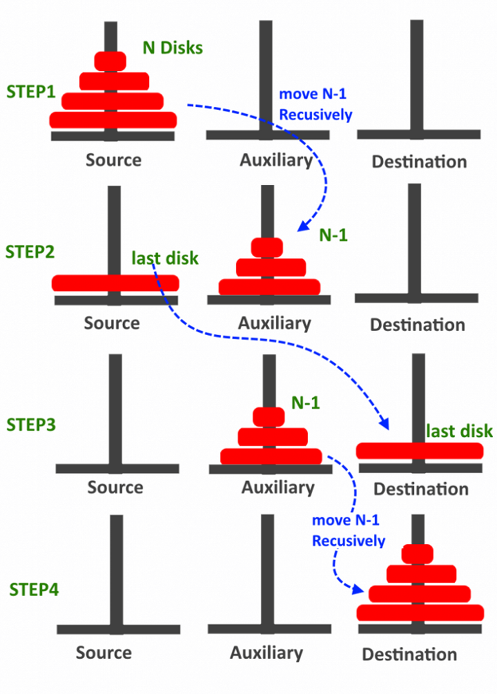

## 하노이의 탑

* 크기가 다른 원반이 n개가 있고 원반을 끼울 수 있는 기둥이 세 개 있다. 하노이의 탑 문제는 어떻게 하면 원반 n개를 모두 가장 왼쪽 기둥에서 오른쪽 기둥으로 옮길 수 있을까 하는 문제이다.

### 하노이의 탑의 규칙

* 크기가 다른 원반 n개를 출발점 기둥에서 도착점 기둥으로 전부 옮겨야 한다.
* 원반은 한 번에 한 개씩만 옮길 수 있다.
* 원반을 옮길 때는 한 기둥의 맨 위 원반을 뽑아, 다른 기둥의 맨 위로만 옮길 수 있다(기둥의 중간에서 원반을 빼내거나 빼난 원반을 다른 기둥의 중간으로 끼워 넣을 수 없다).
* 원반을 옮기는 과정에서 큰 원반을 작은 원반 위로 올릴 수 없다.

### 하노이의 탑 알고리즘

##### 1-A. 원반이 한 개면 그냥 옮기면 끝이다.(종료 조건)
##### 1-B.원반이 n개일 때  
##### &nbsp;&nbsp;&nbsp;&nbsp;1. 1번 기둥에 있는 n개 원반 중 n-1개를 2번 기둥으로 옮긴다(3번 기둥을 보조 기둥으로 사용).
##### &nbsp;&nbsp;&nbsp;&nbsp;2. 1번 기둥에 남아 있는 가장 큰 원반을 3번 기둥으로 옮긴다.
##### &nbsp;&nbsp;&nbsp;&nbsp;3. 2번 기둥에 있는 n-1개 원반을 다시 3번 기둥으로 옮긴다(1번 기둥을 보조 기둥으로 사용).

 

